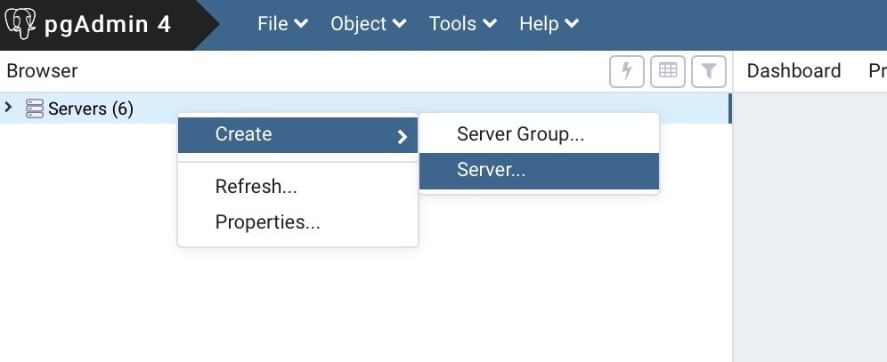
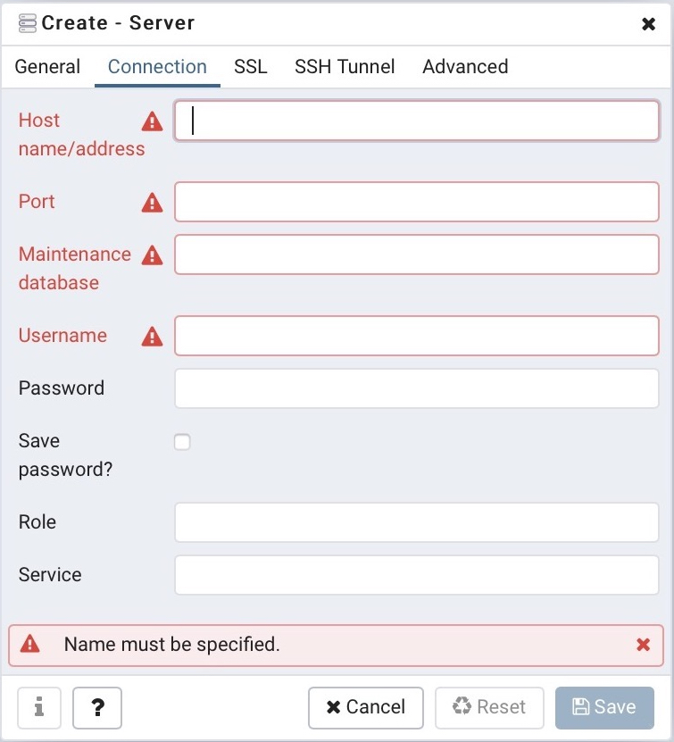

```{r setup, include=FALSE}
knitr::opts_chunk$set( fig.pos = 'h', echo = TRUE)
```

##Background

The Foresite database provides a centralized repository and intersection of several public geospatial data layers including the 2008 FSA Common Land Unit (CLU) layer, annual NASS Cropland Data Layers (CDL), the NRCS Soil Survey Geographic Database (SSURGO), as well as state, county, watershed boundaries. These intersection of these data sources enables the the generation of field-to-regional scale estimates of soil properties and historical cropping rotations. The database is implemented using PostgreSQL with PostGIS extension for geospatial processing. Data from the Foresite database may be directly queried and exported in a variety of GIS and flat file formats ( e.g. .shp, .gdb, .csv, .txt) using third-party software or command line tools. The database also provides a platform for serving crop, soils, and land management practice data directly coupled with cropping system models to be used for environmental and economic analysis. As an example, a Python wrapper module was developed to automate the initialization of the APSIM cropping system model for a specific field-site or region (e.g. county, watershed). The wrapper enables large numbers of inputs to be generated in order to perform regional subfield scale simulations to estimate crop yields and soil carbon and nitrogen cycle impacts (soil organic carbon changes, N2O emissions, NO3 leaching, etc.) from varying land management practices. 

##Data sources

###USDA-FSA Common Land Unit (CLU)
The Foresite database includes a copy of the [2008 Common Land Unit](https://www.fsa.usda.gov/programs-and-services/aerial-photography/imagery-products/common-land-unit-clu/index) (CLU) data layer (_clu.clu_conus_ table) that may be used to identify individual agricultural parcels, or field boundary polygons, within the U.S. Each CLU polygon is stored as in a WKB geometry format and identified within the Foresite CLU schema by a unique identifier (_clukey_). Following 2008, the CLU became restricted from public release. It is therefore considered a static resource within the Foresite database that does not need to be updated.

###USDA-NASS Cropland Data Layer
Annual USDA-NASS Cropland Data Layers (CDL) are stored within the Foresite database to provide historical (currently 2008-2019) estimates of land cover associated with geospatial boundaries such as cropping system field boundaries. The annual 30m raster data is available for direct download from the [USDA-NASS website](https://www.nass.usda.gov/Research_and_Science/Cropland/Release/index.php). The annual CDL's are used To estimate crop rotations associated with the CLU polygons, each yearly CDL raster is intersected with the CLU layer to identify annual land covers. The dominant crop within each polygon is then identified based on the maximum number of 30m pixels within each boundary.

###SSURGO 
The 2019 SSURGO soils database provides estimates of physical soil properties associated with spatially explicit polygons covering a majority of the U.S. territory. Additionally, the gSSURGO version provides a rasterized version of the data. Additional information and metadata including the SSURGO database design, property descriptions, and property units is provided at [www.nrcs.usda.gov](https://www.nrcs.usda.gov/wps/portal/nrcs/detail/soils/survey/?cid=nrcs142p2_053627). SSURGO data is updated annually in addition to the unique identifiers for soils (i.e. _mukey_). Therefore tracking the specific SSURGO version used with a given analysis is required. Outdated versions of SSURGO should be maintained for a maximum of 2-3 years in separate database schemas (i.e. ssurgo_2019, ssurgo_2020). This will provide a mechanism of support for maintaining aging datasets until a certain point in time at which the data is archived or deleted.

###Commodity prices and crop production costs

Historical corn and soybean commodity prices and production cost estimates are obtained from Iowa State University Extension Ag Decision Maker.

* [Crop budgets](https://www.extension.iastate.edu/agdm/crops/html/a1-20.html)

* [Historical grain prices](https://www.extension.iastate.edu/agdm/crops/pdf/a2-11.pdf)

##Connecting to the Foresite database

Connecting to the foresite database currently requires a local connection to the Iowa State network. For off-campus users, remote access to the [Iowa State VPN](https://www.it.iastate.edu/services/vpn) using a valid ISU user account is required. Connecting to the Foresite database requires a third-party tool such as [pgAdmin](https://www.pgadmin.org) or [Navicat](https://www.navicat.com/en/products/navicat-for-postgresql). The psql command line tool can also be used to access and manage the database, but does not provide a graphical user interface.

###pgAdmin/Navicat

To connect to the Foresite database, users must obtain a valid username and password from a Foresite Admin as well as the port number and host IP address. With this information, a new server connection can be created in the pgAdmin or Navicat tools. In pgAdmin, right-click _Servers_ in the right pane and select _Create --> Server..._ (Figure 1; this can also be done through the _Object_ menu). A new window should appear with a _Connection_ tab under which the host-address, port number, and user credentials can be entered (Figure 2). After entering this information, click _Save_. You should now see the _aepe_ database available under the _Servers_ list in the right pane. Double-clicking the server from the list will connect to the Foresite database and allow the user to access the varying schemas and tables. The _Query Tool_ can be accessed from the _Tools_ menu and provides the ability to directly access and process data.  

```{r echo=FALSE, fig.cap="Create new database connection", fig.align = 'center', out.width = '30%'}

```  


```{r echo=FALSE, fig.cap="Complete connection information", fig.align = 'center', out.width = '30%'}

```

###psql
When [installing PostgreSQL](https://www.postgresqltutorial.com/install-postgresql/) on a local machine, users are given the option to install. The [_psql_](https://www.postgresql.org/docs/current/app-psql.html) utility provides command line access to PostgreSQL servers including the Foresite database. The _psql_ command and arguments can be useful in situations when query execution time is expected to be unusually long or when exporting data to a flat file format. The following examples can be used to export a database table to a tab delimited flat file as well as import a file to a database table.

Export table to file:

__psql -h <> -p <> -U <> -d <> -c \"\\copy schema.table to \'output_file.txt\' delimiter E\'\\t\' csv header\"__  

Import table from file:

__psql -h <> -p <> -U <> -d <> -c \"\\copy schema.table from \'output_file.txt\' delimiter E\'\\t\' csv header\"__  

where  
  -h: host/server address  
  -p: port  
  -U: user  
  -d: database name  


##Data onboarding

Geospatial data layers may be imported to the Foresite database using different approaches. The following section provides information related to onboarding of several specific data layers as well as more general file formats. Several primary data sources, including SSURGO and CDL data, are updated annually by the USDA and NRCS and must therefore be updated within Foresite to ensure consistency. Methods for importing and exporting data to common geospatial formats including ESRI Shapefiles and Geodatabases are also detailed.  

###USDA-NASS Cropland Data Layer

CDL raster data can be imported into the Foresite database by altering and executing the _cdl\_import.py_ and _add\_raster\_constraints.sql_ queries located in the [Foresite Github](https://github.com/isuforesite/Foresite.git) repository. The imported CDL layer is interested with CLU polygons to identify the yearly dominant crop cover associated with each CLU. The _clu.clu_cdl_ table is updated with the release of the CDL each year using the _clu\_cdl\_intersection.sql_ query. The _clu.clu\_cdl_ table is then used to derive an estimated crop rotation across the available data years.

###SSURGO

SSURGO data is updated annually and available for direct download from the USDA-NRCS following 2019 ([https://nrcs.app.box.com/v/gateway](https://nrcs.app.box.com/v/gateway/folder/17971946225)). The .gdb files. Contained within the downloaded archive are imported into the Foresite database using the GDAL [_ogr2ogr_](https://gdal.org/programs/ogr2ogr.html) command line utility. The _ssurgo\_import.txt_ in the Foresite repository provides explicit commands for using the ogr2ogr tool to importing the SSURGO database (.gdb). After successfully importing SSURGO, the ssurgo_import.sql query is used to ensure all soil mapunit polygon geometries are valid and add constraints and indexes to the SSURGO data tables. Spatially explicit boundaries defining the unique SSURGO soil mapunits are stored in vector format (WKB geometry) in the mupolygon table within the _ssurgo_2019_ database schema. A unique identifier associated with each soil mapunit polygon (mukey) is used join to the mapunit and component tables. Soil components are joined to the chorizon table containing physical soil properties associated with each soil component through varying depth horizons.

The mupolygon layer is intersected with the CLU polygons to identify (and clip) all subfield soil mapunits located within each CLU boundary. The intersection is performed annually with the against the updated SSURGO data using the clu_ssurgo_intersection.sql query in the Foresite repository. Results of the SSURGO 2019 intersection for each CLU including the CLU-clipped soil mapunit polygons are stored in the _clu.clu\_mupoly19_ table.

###ESRI Shapefiles (.shp) and ArcGIS Geodatabases (.gdb)

Spatial data is often stored in Shapefiles (.shp) or Geodatabases (.gdb) that can be imported directly into the Foresite database for processing with other data layers. The _ogr2ogr_ command line tool provides a simple means of performing such imports. The _ogr2ogr_ utility is part of the [GDAL](https://gdal.org/index.html) tools and libraries. Instructions for installing the GDAL tools can be found at [https://gdal.org/download.html](https://gdal.org/download.html). For Windows machines, the [OSGeo4W](https://trac.osgeo.org/osgeo4w/) package provides a convinient way of installing GDAL tools as well as other geospatial software. Additionally, OSGeo4W provides a shell with the binary paths to tools like _ogr2ogr_ predefined - avoiding the need to set paths in normal system shell. Once the GDAL tools have been successfully installed, the following commands may be used by altering the necessary arguments.

overwrite existing database table:

__ogr2ogr -t_srs EPSG:4326 -f "PostgreSQL" PG:"user=<> host=<> port=<> dbname=<> password=<>" import_.shp -nlt MULTIPOLYGON -progress -nln schema_name.table_name -overwrite__

append to existing database table:

__ogr2ogr -t_srs EPSG:4326 -f "PostgreSQL" PG:"user=<> host=<> port=<> dbname=<> password=<>" import_.shp -nlt MULTIPOLYGON -progress -nln schema_name.table_name -append__

export to Shapefile

__ogr2ogr -f "ESRI Shapefile" -t_srs EPSG:4326 export_.shp PG:"host=<> port=<> user=<> dbname=<> password=<> active_schema=isa_test" -sql "select * from schema.tablename" -nlt MULTIPOLYGON -progress -overwrite__

### Raster data (GeoTIFF)

Similar to _ogr2ogr_, [_raster2pgsql_](https://postgis.net/docs/using_raster_dataman.html) is a command line tool for loading raster data into a PostgreSQL table. The executable is a component of the [PostGIS](https://postgis.net) extension.

__raster2pgsql -Y -q -I -N 0 -s 102039 -t 50x50 raster_file.tif schema.table | psql -h <> -p <> -d <> -U <>__

where

  -h: host/server address
  
  -p: port
  
  -U: user
  
  -d: database name


