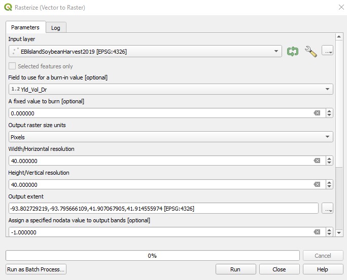

# Latitude (-90 to 90) and longitude (-180 to 180)

### Convert vector data to raster
Step 1:
* add boundary and yield monitor vector layers  

Step 2
* Convert yield polygons to raster with gdal’s rasterize (vector to raster) 
* Note: the higher the width/horizontal resolution the more grid points
* See example below  
  
  
  
### Intersect SSURGO and field boundaries  
Step 1:
* add field boundary  

Step 2:
* Add SSURGO soils.
* Easiest way is to select the underlying county data from the database with fips. County IDs can be found at https://websoilsurvey.nrcs.usda.gov/app/WebSoilSurvey.aspx (state of Iowa is 19, so 19015 is Boone county with fips 015)
* Once the county SSURGO data is added you can do an intersection with the field boundary and ssurgo to get underlying soils.
* Once intersected, area needs to be recalculated with 'Add geometry attributes'. This area can then be multipled by 0.000247105 to get the area in acres.\

### Calculate TWI with SAGA
1.	‘Fill sinks’ (Planch and Darbeaux) using DEM as input.
2.	Calculate Slope, Aspect, Curvature using the 'filled' DEM from step 1.
3.	Take the filled dem from step 1 and calculate ‘Flow Accumulation’ (Top Down)
4.	Calculate ‘Flow Width and Specific Catchment Area’ by taking filled DEM from step 1 and
    the ‘Flow Accumulation’ from step 3 (Flow Accumulation is the input for ‘Total Catchment Area’) 
5.	Calculate TWI using the ‘Specific Catchment Area’ from step 4 and the Slope from step 2.

### Yield monitor cleaning
Currently, outliers are removed by simply removing any point  
with bu/ac under 25 or over 350 bu/ac (col. Yld_Vol_Dr)

### Looping through Pandas DF

### create a grid 
Preliminary Considerations

It makes a slight difference how your certain area is defined. If it's just a rectangular area (note: rectangular in projection is not neccessarily rectangular on Earth's surface!), you can simply iterate from min to max in both coordinate dimensions using your desired step size. If you have an arbitrary polygon shape at hand, you need to test which of your generated points intersects with that poly and only return those coordinate pairs for which this condition holds true.
Calculating a Regular Grid

A regular grid does not equal a regular grid across projections. You are talking about latitude/longitude pairs, which is a polar coordinate system measured in degrees on an approximation of Earth's surface shape. In lat/lon (EPSG:4326), distances are not measured in meters/kilometers/miles, but rather in degrees.

Furthermore, I assume you want to calculate a grid with its "horizontal" steps being parallel to the equator (i.e. latitudes). For other grids (for example rotated rectangular grids, verticals being parallel to longitudes, etc.) you need to spend more effort transforming your shapes.

Ask yourself: Do you want to create a regularly spaced grid in degrees or in meters?

A grid in degrees

If you want it in degrees, you can simply iterate:

stepsize = 0.001
for x in range(lonmin, lonmax, stepsize):
    for y in range(latmin, latmax, stepsize):
        yield (x, y)

But: Be sure to know that the length in meters of a step in degrees is not the same across Earth's surface. For example, 0.001 delta degrees of latitude close to the equator covers a different distance in meters on the surface than it does close to the poles.

A grid in meters

If you want it in meters, you need to project your lat/lon boundaries of your input area (your certain area on a map) into a coordinate system that supports distances in meters. You can use the Haversine formula as a rough approximation to calculate the distance between lat/lon pairs, but this is not the best method you can use.

Better yet is to search for a suitable projection, transform your area of interest into that projection, create a grid by straightforward iteration, get the points, and project them back to lat/lon pairs. For example, a suitable projection for Europe would be EPSG:3035. Google Maps uses EPSG:900913 for their web mapping service, by the way.

In python, you can use the libraries shapely and pyproj to work on geographic shapes and projections:

import shapely.geometry
import pyproj

# Set up transformers, EPSG:3857 is metric, same as EPSG:900913
to_proxy_transformer = pyproj.Transformer.from_crs('epsg:4326', 'epsg:3857')
to_original_transformer = pyproj.Transformer.from_crs('epsg:4326', 'epsg:3857')

# Create corners of rectangle to be transformed to a grid
sw = shapely.geometry.Point((-5.0, 40.0))
ne = shapely.geometry.Point((-4.0, 41.0))

stepsize = 5000 # 5 km grid step size

# Project corners to target projection
transformed_sw = to_proxy_transformer.transform(sw.x, sw.y) # Transform NW point to 3857
transformed_ne = to_proxy_transformer.transform(ne.x, ne.y) # .. same for SE

# Iterate over 2D area
gridpoints = []
x = transformed_sw[0]
while x < transformed_ne[0]:
    y = transformed_sw[1]
    while y < transformed_ne[1]:
        p = shapely.geometry.Point(to_original_transformer.transform(x, y))
        gridpoints.append(p)
        y += stepsize
    x += stepsize

with open('testout.csv', 'wb') as of:
    of.write('lon;lat\n')
    for p in gridpoints:
        of.write('{:f};{:f}\n'.format(p.x, p.y))
